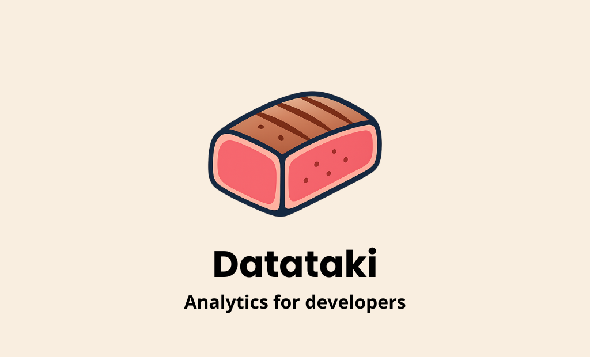

# Datataki

A lightweight client-side event tracking library for web applications. Track user sessions, page views, interactions and custom events with minimal setup.



## Features

- 🔄 Automatic session tracking
- 📊 Page view tracking 
- 🖱️ Click tracking with custom data attributes
- 📜 Scroll depth and direction tracking
- ✨ Custom events support
- 📱 Device type detection
- 🔍 UTM parameter tracking
- ⚡ Real-time event dispatching option
- 🐛 Debug mode

## Installation

```bash
npm install @datataki/sdk
# or
yarn add @datataki/sdk
```

## Quick Start

```javascript
import { startTracking, sendCustomEvent } from '@datataki/sdk';

// Initialize tracking
startTracking('YOUR_API_URL', {
  debug: false,
  realTime: true,
  sessionTimeout: 1800000,
  excludeRoutes: [/^\/admin/, '/login'],
  samplingRate: 0.5,
  globalMetadata: {
    appVersion: '1.0.1',
    environment: 'production',
  },
});

// Send custom event
sendCustomEvent('button_click', {
  buttonId: 'submit-form',
  category: 'form',
  isValid: true,
  tags: ['registration', 'user']
});
```

## Configuration

The `startTracking` function accepts these configuration options:

```javascript
interface DatatakiConfig {
  debug?: boolean; // Enable console logging
  realTime?: boolean; // Enable real-time event dispatching
  sessionTimeout?: number; // Inactivity timeout in ms (default: 15m, minimum: 30s)
  samplingRate?: number; // Allow to track only a percentage of users (default: 1, range: 0-1)
  excludeRoutes?: Array<string | RegExp>; // List of routes (exact string or RegExp) on which we do NOT want to trace
  globalMetadata?: Record<string, string | number | boolean | string[]>; // Include global metadata to be sent with all events
}
```

### Configuration Validation

The library performs the following validations on configuration:

- `sessionTimeout` must be at least 30 seconds
- `samplingRate` must be a number between 0 and 1
- `globalMetadata` is validated for each event (max 12 keys, max 10KB size)

### Route Exclusion

The `excludeRoutes` option allows you to specify routes where certain events should not be tracked:

```javascript
startTracking('YOUR_API_URL', {
  excludeRoutes: [
    '/admin', // Exact path match
    /^\/private/, // Regex pattern match
    '/dashboard/*' // Wildcard pattern
  ]
});
```

When a route is excluded:
- Scroll events are not tracked
- Click events are not tracked
- Other events (page views, custom events, session events) are still tracked
- Routes can be specified as exact strings or RegExp patterns

This is useful for:
- Excluding admin/private areas from analytics
- Reducing noise in high-traffic areas
- Complying with privacy requirements for sensitive pages

## Automatic Events

Datataki automatically tracks these events:

### Session Events
- `SESSION_START`: When a new session begins
- `SESSION_END`: When session ends due to inactivity/page close

### Page Events
- `PAGE_VIEW`: On initial load and navigation changes
- `SCROLL`: Records scroll depth and direction
- `CLICK`: Captures click events with element details

### Click Events

Datataki tracks clicks in two ways:

#### 1. Basic Click Events
Every click on your website is automatically tracked with basic information:

```javascript
{
  element: 'button', // HTML element type
  x: number, // X coordinate
  y: number, // Y coordinate
  id?: 'signup_btn', // Element ID (if present)
  class?: 'btn' // Element class (if present)
}
```

#### 2. Custom Click Events
To send a custom event when clicking an element, add the `data-taki-name` attribute. You can also include `data-taki-value` to add additional metadata:

```html
<!-- Basic usage -->
<button data-taki-name="signup_button">Sign Up</button>

<!-- With additional metadata -->
<button 
  data-taki-name="signup_button"
  data-taki-value="premium_plan">
  Sign Up Premium
</button>
```

When clicking these buttons, Datataki will:
1. Send the basic click event (as shown above)
2. Send a custom event with:

```javascript
{
  name: 'signup_button',
  metadata: {
    value: 'premium_plan' // Only included if data-taki-value is present
  }
}
```

## Custom Events

Send custom events with metadata:

```javascript
sendCustomEvent('purchase_completed', {
  productId: '123',
  price: 99.99,
  categories: ['electronics', 'phones']
});
```

### Event Validation

The library performs strict validation on custom events:

- Event name: max 120 characters
- Metadata object: max 10KB
- Max 12 metadata keys
- Arrays: max 12 items
- Valid types: string, number, boolean, string[]
- Invalid events will be logged to console in debug mode

Example of valid metadata:
```javascript
{
  productId: '123', // string
  price: 99.99, // number
  isAvailable: true, // boolean
  tags: ['electronics', 'phones'] // string[]
}
```

## Event Payload

All events include:
```javascript
{
  type: EventType;
  page_url: string;
  timestamp: number;
  // Event specific data...
}
```

## Device Detection

Datataki automatically detects device type:
- `mobile`
- `tablet` 
- `desktop`

## UTM Parameter Tracking

The library automatically captures UTM parameters:
- utm_source
- utm_medium
- utm_campaign
- utm_term
- utm_content

These are included in the `SESSION_START` event.

## Real-time Events

Enable real-time event dispatching by setting `realTime: true` in the configuration:

```javascript
startTracking('YOUR_API_URL', { 
  realTime: true,
  debug: true // Optional: enables console logging of events
});

// Listen for real-time events
window.addEventListener('DatatakiEvent', (e: CustomEvent) => {
  const event = e.detail.event;
  console.log('Real-time event:', event);
});
```

Real-time events are dispatched immediately when they occur, in addition to being queued for batch processing. This is useful for:
- Debugging and development
- Real-time analytics dashboards
- Immediate user interaction feedback

Note: Real-time events are dispatched in the same format as batch events, maintaining consistency in your event handling.

## Batch Processing

Events are collected in a queue and sent in batches every 10 seconds to optimize network usage and reduce server load. The batch includes:

- User and session identification
- Device type
- All queued events
- Global metadata (if configured)
- Debug mode flag (if enabled)

The batch is sent using the Beacon API, which ensures reliable delivery even when the page is being closed or the browser is navigating away.

Example of a batch payload:
```json
{
  "user_id": "550e8400-e29b-41d4-a716-446655440000",
  "session_id": "550e8400-e29b-41d4-a716-446655440000-1234567890",
  "device": "desktop",
  "events": [
    {
      "type": "session_start",
      "page_url": "https://example.com/products",
      "timestamp": 1678901234566,
      "referrer": "https://google.com"
    },
    {
      "type": "page_view",
      "page_url": "https://example.com/products",
      "timestamp": 1678901234567
    },
    {
      "type": "click",
      "page_url": "https://example.com/products",
      "timestamp": 1678901234568,
      "click_data": {
        "element": "button",
        "x": 100,
        "y": 200,
        "attrData": {
          "name": "add_to_cart",
          "value": "product_123"
        }
      }
    },
    {
      "type": "custom",
      "page_url": "https://example.com/products",
      "timestamp": 1678901234569,
      "custom_event": {
        "name": "product_view",
        "metadata": {
          "productId": "123",
          "category": "electronics",
          "price": 99.99
        }
      }
    }
  ],
  "appVersion": "1.0.1",
  "environment": "production"
}
```

## Debug Mode

Enable debug mode to log events to console:

```javascript
startTracking('YOUR_API_URL', { debug: true });
```

## Browser Support

Requires browsers with support for:
- localStorage
- Beacon API
- CustomEvent
- matchMedia

## Privacy & Data Collection

Datataki is designed with privacy in mind:

### Anonymous by Design
- No collection of personal identifiable information (PII)
- Random session IDs that cannot be linked to individuals
- No IP address tracking
- No cookies used

### Data Collection
All collected data is anonymous:
```javascript
{
  type: EventType;
  page_url: string; // without query params containing PII
  timestamp: number;
  // Event specific anonymous data
}
```

### Custom Events
When sending custom events, ensure no PII is included:

```javascript
// Good ✅
sendCustomEvent('button_click', {
  buttonId: 'submit-form',
  category: 'navigation',
  isValid: true
});

// Bad ❌
sendCustomEvent('form_submit', {
  email: 'user@email.com', // No PII!
  name: 'John Doe', // No PII!
  userId: '12345' // No PII!
});
```

## License

MIT 